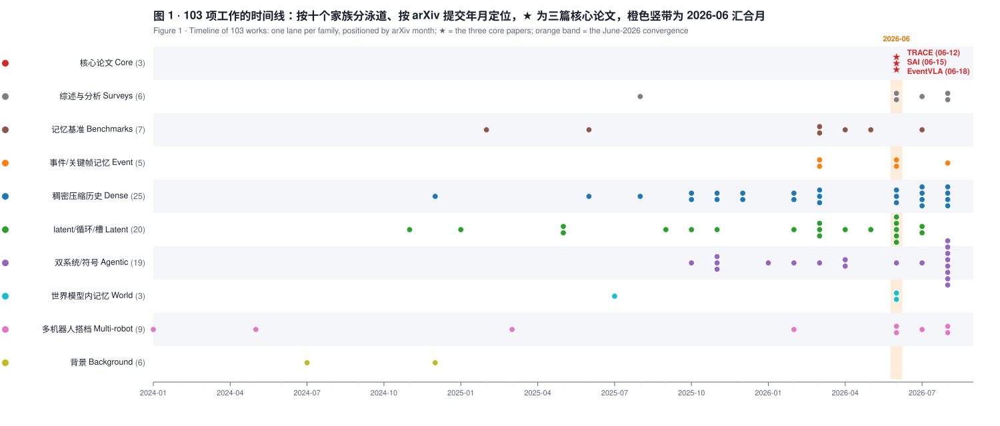
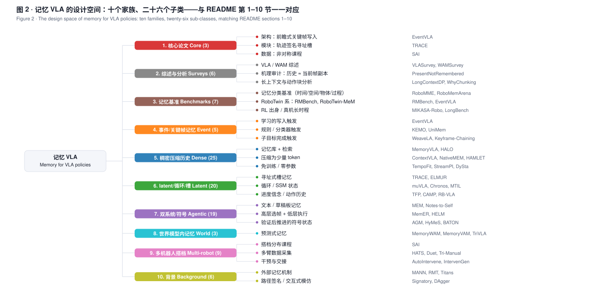

# Awesome Memory VLA (awesome_memory_vla)

[](https://awesome.re)
[](CONTRIBUTING.md)
[](LICENSE)


[English](README_en.md) | 中文

We maintain a curated list of resources on **memory for Vision-Language-Action and visuomotor policies** — how a robot policy acts when the evidence it needs is no longer in the current observation: occluded objects, vanished cues, task progress, and the phase of a partly visible partner robot.

我们维护一份「记忆 VLA」资源清单：围绕 2026 年 6 月的三篇论文 **EventVLA**（事件驱动的稀疏视觉证据记忆）、**TRACE**（轨迹签名寻址的固定槽 latent 记忆）与 **SAI**（多机器人协作的非对称模仿课程）展开，向外扩展到 100 篇周边工作——综述与分析、记忆基准、事件/关键帧记忆、稠密压缩历史、latent/循环/槽记忆、双系统与符号记忆、世界模型内的记忆、多机器人搭档记忆，以及必要的背景文献。

*Maintained by [asimfish](https://github.com/asimfish). Contributions welcome — see [Contributing](#contributing).*

## 产物入口（Deliverables）

| 想要 | 打开 | 说明 |
|---|---|---|
| **15 分钟拿到全部结论** | [`report/survey_slides.html`](report/survey_slides.html) · [PDF](report/survey_slides.pdf) | 32 页汇总 PPT：执行摘要 → 总览图 → 三主角 → 证据链 → 六个纵深专题 → 趋势 / 洞见 / 预测 / 缺口 / 口径账本；浏览器打开 ← → 翻页、F 全屏 |
| **系统研读** | [`report/survey_full_report.pdf`](report/survey_full_report.pdf) · [HTML](report/survey_full_report.html) | 110 页全文报告：总览图 + 趋势洞见 + 三篇深读 + 设计矩阵 + 研究机会 + 口径账本 + 103 篇解读按十个家族合订（[英文版](report/survey_full_report_en.pdf) 51 页） |
| **三篇主角的深读** | [EventVLA](reports/01_eventvla_cn.md) · [TRACE](reports/02_trace_cn.md) · [SAI](reports/03_sai_cn.md) | 每篇含方法拆解 / 全部关键数字 / 判读 / 与另两篇的对照；中英各一版，另有 PDF（`reports/pdf/`） |
| **趋势与洞见** | [`reports/04_trends_insights_cn.md`](reports/04_trends_insights_cn.md) · [English](reports/04_trends_insights_en.md) | 五个家族 · 六问设计空间 · 跨基准证据 · 十个洞见 · 七个开放问题 · 四个研究方向 |
| **研究机会清单** | [`insights/OPEN_PROBLEMS.md`](insights/OPEN_PROBLEMS.md) | 14 个无人占位的空白，按写入与寻址 / 容量与纪律 / 评测与诊断 / 路线与成本 / 多机器人排列，每条配「为什么重要 + 最小可行实验 + 相关解读」；只做一件事就做第 1 条 |
| **数字口径账本** | [`insights/NUMBERS_LEDGER.md`](insights/NUMBERS_LEDGER.md) | 28 个头条数字逐条标注任务集 / 指标类型 / 试验规模 / 独立性 / 口径提醒——并排任何两个数字前先查此表 |
| **设计空间矩阵** | [`insights/DESIGN_SPACE_MATRIX.md`](insights/DESIGN_SPACE_MATRIX.md) | 40 个方法 × 存什么 / 何时写 / 寻址 / 容量 / 接在哪 / 监督 |
| **总览图** | [图 1 时间线](assets/fig1_timeline.svg) · [图 2 分类树](assets/fig2_taxonomy.svg) | 矢量 SVG；`scripts/make_figures.py` 生成，深色 PPT 版见 `assets/*_dark.svg` |
| **论文原文与中译** | [`papers/pdf/`](papers/pdf/) · [`papers/zh/`](papers/zh/) | 17 篇英文原版 · 17 篇 [SuperTranslate](https://github.com/asimfish/super_translate) + DeepSeek 保版式中译，逐页 QA 见 [QA_REPORT](papers/zh/QA_REPORT.md) |
| **全部解读** | [`notes/`](notes/) | 103 份笔记：14 篇邻居为基于全文的手写深读，其余为一句话定位 + 与核心论文的关系 + 摘要 |
| **Beamer 讲稿版** | [`slides/awesome_memory_vla_deck.pdf`](slides/awesome_memory_vla_deck.pdf) | 21 页 XeLaTeX 幻灯片（beamer-skill 规范：16:9、无 overlay、参考文献页、备份页） |

> 所有成功率数字都依赖各自的任务集与判定口径，**不同工作的数字禁止直接比大小**；并排前先查 [数字口径账本](insights/NUMBERS_LEDGER.md)。

## 总览图



*图 1 · 103 项工作的时间线：按十个家族分泳道、按 arXiv 提交年月定位，★ 为三篇核心论文，橙色竖带为 2026-06 汇合月。*



*图 2 · 记忆 VLA 的设计空间：十个家族、26 个子类——与下文第 1–10 节一一对应。*

## 为什么是现在

2026 年 6 月 12–18 日，两个互不相识的团队在一周内把「决策时刻证据已经消失」这个问题推到三个层面：**TRACE**（浙大 / 悉尼）把记忆做成外挂模块，用机器人轨迹的路径签名给固定槽编地址，五个真机延迟证据任务 ACT 从 25.5 提到 69.2 阶段进度，倒放历史后路由相似度掉到 37.8；**SAI**（同组）把双机器人协作里「搭档看不全」处理成数据课程，成功率从 23–50% 提到 53–70%，30 步历史 token 把提前松手从 64.5% 压到 16.1%；**EventVLA**（中科大 / 上海 AI Lab）把「何时该记住」做成架构里的一个预测头，在自建的 RoboTwin-MeM 上从 18.0% 提到 75.2%，并用一个干净的消融证明原图记忆胜过 latent（24.9%）。同一个月里 KEMO、UniMem、WeaveLA、MemoryWAM 从不同架构出发汇合到「事件驱动的稀疏写入」，Present-but-Not-Remembered 用探针给出机理：冻结 VLA 里的历史基本是当前帧的冗余副本。春天落地的 RMBench、RoboMME、RoboMemArena 三个基准是这一切的靶子。

**本仓库特色（Features）**:

- 📄 **17 篇论文的英文 PDF**（`papers/pdf/`：三篇核心论文 + 14 篇最近邻居）与 🇨🇳 **保版式中文翻译 PDF**（`papers/zh/`，由 [SuperTranslate](https://github.com/asimfish/super_translate) + DeepSeek 生成，逐页视觉 QA 见 [papers/zh/QA_REPORT.md](papers/zh/QA_REPORT.md) 与 [QA_SUMMARY.md](papers/zh/QA_SUMMARY.md)）
- 📝 **三篇逐篇深读报告（中英双语）**：`reports/01_eventvla_{cn,en}.md`、`reports/02_trace_{cn,en}.md`、`reports/03_sai_{cn,en}.md`，含方法拆解、全部关键数字、判读与关联阅读；每篇另有 PDF（`reports/pdf/`）
- 💡 **趋势与洞见报告（中英双语）**：`reports/04_trends_insights_{cn,en}.md` —— 五个技术家族、六问设计空间、跨基准证据表、十个洞见、七个开放问题与四个研究方向；另有 [研究机会清单](insights/OPEN_PROBLEMS.md)（14 条，每条配最小可行实验）与 [数字口径账本](insights/NUMBERS_LEDGER.md)（28 条）
- 🧭 **设计空间矩阵**：`insights/DESIGN_SPACE_MATRIX.md`，40 个方法按「存什么 / 何时写 / 寻址 / 容量 / 集成点 / 监督」六列横向对比
- 🗂️ **103 篇论文笔记**（`notes/`）：14 篇最近邻居（KEMO、UniMem、MemoryVLA、MemER、MEM、RMBench、RoboMME、RoboMemArena、Present-but-Not-Remembered、Chronos、μVLA、AGM、HyMeS、AutoIntervene）为基于全文的手写深读（问题 / 方法 / 关键数字 / 局限 / 与核心论文的关系），其余 89 篇含一句话定位、与核心论文的关系、原文摘要与链接
- 📚 **BibTeX**（`awesome_memory_vla.bib`，全部条目可直接引用）
- 📊 **汇总 PPT 与全文报告**：[32 页 HTML PPT](report/survey_slides.html)（[PDF](report/survey_slides.pdf)）· [110 页全文报告](report/survey_full_report.pdf)（总览图 + 趋势 + 三篇深读 + 矩阵 + 研究机会 + 口径账本 + 103 篇解读按家族合订；[英文版](report/survey_full_report_en.pdf)）· [Beamer 讲稿版](slides/awesome_memory_vla_deck.pdf)（21 页）· 总览图 [图 1 时间线](assets/fig1_timeline.svg) / [图 2 分类树](assets/fig2_taxonomy.svg)
- 🔧 **可复现脚本**（`scripts/`）：arXiv 检索、manifest 构建、笔记/README/BibTeX 生成、翻译、PDF 渲染

## [Content](#content)

<table>
<tr><td colspan="2"><a href="#1-core-papers-deep-dives">1. Core Papers (Deep Dives) (核心论文（逐篇深读）)</a></td></tr>
<tr><td colspan="2"><a href="#2-surveys-and-analyses">2. Surveys and Analyses (综述与分析)</a></td></tr>
<tr><td colspan="2"><a href="#3-benchmarks-for-memory-dependent-manipulation">3. Benchmarks for Memory-Dependent Manipulation (记忆依赖操作的基准)</a></td></tr>
<tr><td colspan="2"><a href="#4-event-and-keyframe-memory">4. Event and Keyframe Memory (事件与关键帧记忆（EventVLA 一族）)</a></td></tr>
<tr><td colspan="2"><a href="#5-dense-and-compressed-visual-history">5. Dense and Compressed Visual History (稠密与压缩的视觉历史)</a></td></tr>
<tr><td colspan="2"><a href="#6-latent-recurrent-and-slot-memory">6. Latent, Recurrent and Slot Memory (latent 状态、循环与槽记忆（TRACE 一族）)</a></td></tr>
<tr><td colspan="2"><a href="#7-dual-system-agentic-and-symbolic-memory">7. Dual-System, Agentic and Symbolic Memory (双系统、智能体与符号记忆)</a></td></tr>
<tr><td colspan="2"><a href="#8-memory-inside-world-and-video-action-models">8. Memory inside World and Video Action Models (世界模型 / 视频动作模型中的记忆)</a></td></tr>
<tr><td colspan="2"><a href="#9-multi-robot-collaboration-and-partner-memory">9. Multi-Robot Collaboration and Partner Memory (多机器人协作与搭档记忆（SAI 一族）)</a></td></tr>
<tr><td colspan="2"><a href="#10-background-memory-mechanisms-and-trajectory-descriptors">10. Background: Memory Mechanisms and Trajectory Descriptors (背景：记忆机制与轨迹描述子)</a></td></tr>
<tr><td colspan="2"><a href="#11-trends--insights">11. Trends & Insights (趋势与洞见)</a></td></tr>
<tr><td colspan="2"><a href="#12-recommended-reading-order">12. Recommended Reading Order (Recommended Reading Order)</a></td></tr>
</table>

**图例 / Legend**: [paper] arXiv 原文 · [pdf] 仓库内英文 PDF · [中译] 保版式中文翻译 PDF · [解读] 中文深读报告 · [note] 论文笔记（一句话定位 + 摘要）

### [1. Core Papers (Deep Dives)](#content)

**核心论文（逐篇深读）** ? 本仓库围绕这三篇 2026 年 6 月的论文展开。它们回答同一个问题——决策时刻证据已经消失，策略靠什么补——但分别把答案放在架构（EventVLA 的关键帧证据记忆）、模块（TRACE 的轨迹寻址槽记忆）和数据（SAI 的搭档分布课程）三个层面。每篇都有中英文详细解读、英文原文 PDF 与保版式中文翻译 PDF。

1. **EventVLA: Event-Driven Visual Evidence Memory for Long-Horizon Vision-Language-Action Policies.** arXiv 2026. [paper](https://arxiv.org/abs/2606.20092) [pdf](papers/pdf/EventVLA_2606.20092.pdf) [中译](papers/zh/EventVLA_2606.20092_zh.pdf) [解读](reports/01_eventvla_cn.md) [note](notes/EventVLA_2606.20092.md)

    *Ganlin Yang, Zhangzheng Tu, Yuqiang Yang, Sitong Mao, Junyi Dong, Tianxing Chen, Jiaqi Peng, Jing Xiong, Jiafei Cao, Jifeng Dai, Wengang Zhou, Yao Mu, Tai Wang*

2. **TRACE: Trajectory-Routed Causal Memory for Delayed-Evidence Visuomotor Imitation.** arXiv 2026. [paper](https://arxiv.org/abs/2606.14551) [pdf](papers/pdf/TRACE_2606.14551.pdf) [中译](papers/zh/TRACE_2606.14551_zh.pdf) [解读](reports/02_trace_cn.md) [note](notes/TRACE_2606.14551.md)

    *Zihao Li, Ranpeng Qiu, Yincong Chen, Guoqiang Ren, Weiming Zhi*

3. **Robots that Collaborate: Sequential Asymmetric Imitation for Learning Coupled Robot Policies.** arXiv 2026. [paper](https://arxiv.org/abs/2606.16490) [pdf](papers/pdf/SAI_2606.16490.pdf) [中译](papers/zh/SAI_2606.16490_zh.pdf) [解读](reports/03_sai_cn.md) [note](notes/SAI_2606.16490.md)

    *Yincong Chen, Ranpeng Qiu, Zihao Li, Yanan Zhou, Guoqiang Ren, Weiming Zhi*

### [2. Surveys and Analyses](#content)

**综述与分析** ? 先读这里的三篇分析再读方法：《Present but Not Remembered》用探针和因果干预说明冻结 VLA 里的历史基本是当前帧的冗余副本；长上下文扩散策略研究说明 naive 加长窗口没有传说中那么脆；WhyChunking 说明动作块的价值之一正是非马尔可夫表达力。

1. **Weights or Skills? A Survey of Robot-Learning Techniques: from Action-Predicting Weights to Robots that Write their Own Skills.** arXiv 2026. [paper](https://arxiv.org/abs/2608.01851) [note](notes/WeightsOrSkills_2608.01851.md)

    *Gaytri Jena, Kapil Wanaskar, Vinija Jain, Aman Chadha, Vasu Sharma, Amitava Das*

2. **Why Does Action Chunking Improve Behavioral Cloning Performance in Robotic Control?** arXiv 2026. [paper](https://arxiv.org/abs/2608.02547) [note](notes/WhyChunking_2608.02547.md)

    *Filippo Lazzati, Kyle Stachowicz, William Chen, Alberto Maria Metelli, Andrew Wagenmaker, Sergey Levine*

3. **Present but Not Remembered: Auditing How Frozen VLAs Encode, Deploy, and Steer Visual History.** arXiv 2026. [paper](https://arxiv.org/abs/2607.03372) [pdf](papers/pdf/PresentNotRemembered_2607.03372.pdf) [中译](papers/zh/PresentNotRemembered_2607.03372_zh.pdf) [note](notes/PresentNotRemembered_2607.03372.md)

    *Chih-Ting Liao, Xin Cao*

4. **World Action Models: A Survey.** arXiv 2026. [paper](https://arxiv.org/abs/2606.20781) [note](notes/WAMSurvey_2606.20781.md)

    *Qiuhong Shen, Shihua Zhang, Yue Liao, Qi Li, Zhenxiong Tan, Shizun Wang, Shuicheng Yan, Xinchao Wang*

5. **Training and Evaluating Diffusion Policies with Long Context Lengths.** arXiv 2026. [paper](https://arxiv.org/abs/2606.16447) [note](notes/LongContextDP_2606.16447.md)

    *Abhinav Agarwal, Adam Wei, Taylan Kargin, Michael Zeng, Cole Becker, Arif Kerem Dayi, Pablo Parrilo, Asuman Ozdaglar, Russ Tedrake*

6. **Large VLM-based Vision-Language-Action Models for Robotic Manipulation: A Survey.** arXiv 2025. [paper](https://arxiv.org/abs/2508.13073) [note](notes/VLASurvey_2508.13073.md)

    *Rui Shao, Wei Li, Lingsen Zhang, Renshan Zhang, Zhiyang Liu, Ran Chen, Liqiang Nie*

### [3. Benchmarks for Memory-Dependent Manipulation](#content)

**记忆依赖操作的基准** ? 2026 年春天落地的 RMBench、RoboMME、RoboMemArena 是夏天方法论文的共同靶子。RoboMME 的结论（记忆表征的效果高度依赖任务）被之后一年的结果反复印证。EventVLA 自带的 RoboTwin-MeM 用 n 参数化「必须记住几个中间关键帧」，是目前唯一专门隔离瞬态证据的基准；更多嵌在方法论文里的基准（ReMemBench、LIBERO-Mem、MemMimic、MemoryRTBench、RuleSafe、Memory-T-Bench、MemoryBench）见对应条目。

1. **RoboDojo: A Unified Sim-and-Real Benchmark for Comprehensive Evaluation of Generalist Robot Manipulation Policies.** arXiv 2026. [paper](https://arxiv.org/abs/2607.04434) [note](notes/RoboDojo_2607.04434.md)

    *Tianxing Chen, Yue Chen, Zixuan Li, Junyuan Tang, Kailun Su, Haoran Lu, Weijie Wan, Baijun Chen, Songling Liu, Haowen Yan, Honghao Su, Zhiyang Dou, Kaixuan Wang, Dandan Zhang, Yunze Liu, Yan Qin, Qiwei Liang, Qiwei Wu, Zijian Lin, Wenwei Lin, Yuran Wang, Minghua He, Tianshu Wu, Ruihai Wu, Jingquan Zhou, Kai-Chong Lei, Haibao Yu, Yuanfeng Ji, Weiyang Jin, Guanyu Lin, Xiaofan Li, Qi Xiong, Renjing Xu, Zhongyu Li, Wenhao Chai, Enze Xie, Ziwei Wang, Yao Mu, Hao Dong, Wojciech Matusik, Mingyu Ding, Wenbo Ding, Ping Luo, Masayoshi Tomizuka*

2. **RoboMemArena: A Comprehensive and Challenging Robotic Memory Benchmark.** arXiv 2026. [paper](https://arxiv.org/abs/2605.10921) [pdf](papers/pdf/RoboMemArena_2605.10921.pdf) [中译](papers/zh/RoboMemArena_2605.10921_zh.pdf) [note](notes/RoboMemArena_2605.10921.md)

    *Huashuo Lei, Wenxuan Song, Huarui Zhang, Jieyuan Pei, Jiayi Chen, Haodong Yan, Han Zhao, Pengxiang Ding, Zhipeng Zhang, Lida Huang, Donglin Wang, Yan Wang, Haoang Li*

3. **LongBench: Evaluating Robotic Manipulation Policies on Real-World Long-Horizon Tasks.** arXiv 2026. [paper](https://arxiv.org/abs/2604.16788) [note](notes/LongBench_2604.16788.md)

    *Xueyao Chen, Jingkai Jia, Tong Yang, Yibo Fu, Wei Li, Wenqiang Zhang*

4. **RoboMME: Benchmarking and Understanding Memory for Robotic Generalist Policies.** arXiv 2026. [paper](https://arxiv.org/abs/2603.04639) [pdf](papers/pdf/RoboMME_2603.04639.pdf) [中译](papers/zh/RoboMME_2603.04639_zh.pdf) [note](notes/RoboMME_2603.04639.md)

    *Yinpei Dai, Hongze Fu, Jayjun Lee, Yuejiang Liu, Haoran Zhang, Jianing Yang, Chelsea Finn, Nima Fazeli, Joyce Chai*

5. **RMBench: Memory-Dependent Robotic Manipulation Benchmark with Insights into Policy Design.** arXiv 2026. [paper](https://arxiv.org/abs/2603.01229) [pdf](papers/pdf/RMBench_2603.01229.pdf) [中译](papers/zh/RMBench_2603.01229_zh.pdf) [note](notes/RMBench_2603.01229.md)

    *Tianxing Chen, Yuran Wang, Mingleyang Li, Yan Qin, Hao Shi, Zixuan Li, Yifan Hu, Yingsheng Zhang, Kaixuan Wang, Yue Chen, Hongcheng Wang, Junjie Wang, Tianhang Yang, Renjing Xu, Ruihai Wu, Yao Mu, Yaodong Yang, Hao Dong, Ping Luo*

6. **RoboCerebra: A Large-scale Benchmark for Long-horizon Robotic Manipulation Evaluation.** NeurIPS 2025. [paper](https://arxiv.org/abs/2506.06677) [note](notes/RoboCerebra_2506.06677.md)

    *Songhao Han, Boxiang Qiu, Yue Liao, Siyuan Huang, Chen Gao, Shuicheng Yan, Si Liu*

7. **Memory, Benchmark & Robots: A Benchmark for Solving Complex Tasks with Reinforcement Learning.** arXiv 2025. [paper](https://arxiv.org/abs/2502.10550) [note](notes/MIKASA-Robo_2502.10550.md)

    *Egor Cherepanov, Nikita Kachaev, Alexey K. Kovalev, Aleksandr I. Panov*

### [4. Event and Keyframe Memory](#content)

**事件与关键帧记忆（EventVLA 一族）** ? 只在「发生了什么」的时刻写入，存原图或原图 token。2026 年中的共识方向：EventVLA 学未来关键帧概率，KEMO 用运动学 + 视觉规则，UniMem 训练事件分类器，WeaveLA 在子目标完成时触发，Keyframe-Chaining 用进度感知查询检索。

1. **UniMem: Unifying Multimodal Memory and Control for Vision-Language-Action Models.** arXiv 2026. [paper](https://arxiv.org/abs/2608.22869) [pdf](papers/pdf/UniMem_2608.22869.pdf) [中译](papers/zh/UniMem_2608.22869_zh.pdf) [note](notes/UniMem_2608.22869.md)

    *Lars Osterberg, Maggie Wang, Mac Schwager*

2. **KEMO: Event-Driven Keyframe Memory for Long-Horizon Robot Manipulation with VLA Policies.** arXiv 2026. [paper](https://arxiv.org/abs/2606.23589) [pdf](papers/pdf/KEMO_2606.23589.pdf) [中译](papers/zh/KEMO_2606.23589_zh.pdf) [note](notes/KEMO_2606.23589.md)

    *Yihan Zeng, Minghao Ye, Yiyuan Chen, Yide Shentu, Philipp Wu, Zike Yan, Zhongyu Li*

3. **WeaveLA: Event Driven Cross-Subtask Latent Memory Weaving for Repetitive Robot Manipulation.** arXiv 2026. [paper](https://arxiv.org/abs/2606.17463) [note](notes/WeaveLA_2606.17463.md)

    *Shoujing Zhu, Zhenyang Liu, Fungmiu Wang, Jiafeng Wang, Bo Yue, Guiliang Liu, Simo Wu, Xiangyang Xue, Taiping Zeng*

4. **Bi-HIL: Bilateral Control-Based Multimodal Hierarchical Imitation Learning via Subtask-Level Progress Rate and Keyframe Memory for Long-Horizon Contact-Rich Robotic Manipulation.** arXiv 2026. [paper](https://arxiv.org/abs/2603.13315) [note](notes/Bi-HIL_2603.13315.md)

    *Thanpimon Buamanee, Masato Kobayashi, Yuki Uranishi*

5. **Non-Markovian Long-Horizon Robot Manipulation via Keyframe Chaining.** arXiv 2026. [paper](https://arxiv.org/abs/2603.01465) [note](notes/KeyframeChaining_2603.01465.md)

    *Yipeng Chen, Wentao Tan, Lei Zhu, Fengling Li, Jingjing Li, Guoli Yang, Heng Tao Shen*

### [5. Dense and Compressed Visual History](#content)

**稠密与压缩的视觉历史** ? 每帧都进，靠压缩、token 化、KV 复用或采样控制成本。这一族的近期趋势是「记忆几乎免费」：NativeMEM 每帧 1 token、TempoFit 免训练复用 K/V、StreamPI 零新增参数、DySta 复用静态 token 的 KV 缓存。EventVLA 的三倍延迟是这一族要解决的问题。

1. **StreamPI: Streaming Multimodal Temporal Modeling for Vision-Language-Action Models.** arXiv 2026. [paper](https://arxiv.org/abs/2608.26067) [note](notes/StreamPI_2608.26067.md)

    *Zhe Liu, Jinghua Hou, Yuxiang Lu, Zhenya Yang, Xianzhe Fan, Junwei Luo, Junyi Li, Ruihua Han, Zhi Hou, Hengshuang Zhao*

2. **Remember Smarter: Visual History Compressor and Hyperbolic Experience Space for Robotic Memory.** arXiv 2026. [paper](https://arxiv.org/abs/2608.15269) [note](notes/RememberSmarter_2608.15269.md)

    *Dai Zhou, Jiexi Yan, Tong Li, Yuxuan Wang, Cheng Deng*

3. **AtlasVLA: Persistent World-Ego State Modeling for Vision-Language-Action Models.** arXiv 2026. [paper](https://arxiv.org/abs/2608.06729) [note](notes/AtlasVLA_2608.06729.md)

    *Guiyu Zhao, Longteng Guo, Yanghong Mei, Zilin Zhu, Yu Zhang, Bin Cao, Mingming Yu, Xingjian He, Jie Jiang, Jing Liu*

4. **BridgeVLA++: A Data-Efficient, Generalizable, and Memory-Augmented Vision-Language-Action Framework for 3D Manipulation.** arXiv 2026. [paper](https://arxiv.org/abs/2608.05042) [note](notes/BridgeVLApp_2608.05042.md)

    *Peiyan Li, Yuze Zhu, Yixiang Chen, Qisen Ma, Yuan Xu, Jiabing Yang, He Guan, Yan Huang, Hongtao Wu, Xiao Ma, Tao Kong, Liang Wang, Tieniu Tan*

5. **FibVLA: An Efficient Temporal Vision-Language-Action Model with Fibonacci Sampling.** arXiv 2026. [paper](https://arxiv.org/abs/2607.29596) [note](notes/FibVLA_2607.29596.md)

    *Li Lin, Wujun Xu, Weiwei Meng, Kaiwen Xia, Kang Hao Cheong, Shuai Wang*

6. **Dual Latent Memory in Vision-Language-Action Models for Robotic Manipulation.** arXiv 2026. [paper](https://arxiv.org/abs/2607.07608) [note](notes/DualLatentMemory_2607.07608.md)

    *Hongyu Qu, Jianzhe Gao, Xiaobin Hu, Shaohuan Yang, Xinlei Yu, Rui Yan, Wenguan Wang, Xiangbo Shu, Shuicheng Yan*

7. **NativeMEM: Native Memory Compression for Long-Horizon Robotic Manipulation.** arXiv 2026. [paper](https://arxiv.org/abs/2607.06678) [note](notes/NativeMEM_2607.06678.md)

    *Ziye Wang, Modi Shi, Chaojun Ni, Jiazhi Yang, Mengdi Li, Zhizhong Su, Tianwei Lin, Hongyang Li*

8. **HiMe: Hierarchical Embodied Memory for Long-Horizon Vision-Language-Action Control.** arXiv 2026. [paper](https://arxiv.org/abs/2607.03449) [note](notes/HiMe_2607.03449.md)

    *Li Ji, Siyin Wang, Pengfang Qian, Xiaopeng Yu, Yihai Tian, Zhaoye Fei, Jingjing Gong, Xipeng Qiu*

9. **Memory Retrieval in Visuomotor Policies for Long-Horizon Robot Control.** arXiv 2026. [paper](https://arxiv.org/abs/2606.25136) [note](notes/MemoryRetrievalVisuomotor_2606.25136.md)

    *Rutav Shah, Yisu Li, Femi Bello, Yuke Zhu, Roberto Martín-Martín*

10. **Scaling Short-Term Memory of Visuomotor Policies for Long-Horizon Tasks.** arXiv 2026. [paper](https://arxiv.org/abs/2606.16178) [note](notes/ScalingSTM_2606.16178.md)

    *Rutav Shah, Rajat Kumar Jenamani, Xiaohan Zhang, Lingfeng Sun, Roberto Martín-Martín, Yuke Zhu, Deva Ramanan, Karl Schmeckpeper*

11. **MemoryVLA++: Temporal Modeling via Memory and Imagination in Vision-Language-Action Models.** arXiv 2026. [paper](https://arxiv.org/abs/2606.09827) [note](notes/MemoryVLApp_2606.09827.md)

    *Hao Shi, Weiye Li, Bin Xie, Yulin Wang, Renping Zhou, Tiancai Wang, Xiangyu Zhang, Ping Luo, Gao Huang*

12. **ST-VLA: Enabling 4D-Aware Spatiotemporal Understanding for General Robot Manipulation.** arXiv 2026. [paper](https://arxiv.org/abs/2603.13788) [note](notes/ST-VLA_2603.13788.md)

    *You Wu, Zixuan Chen, Cunxu Ou, Wenxuan Wang, Wenbo Huang, Lin Cao, Yangtao Chen, Weichao Qiu, Xingyue Quan, Jieqi Shi, Jing Huo, Yang Gao*

13. **AnchorVLA4D: an Anchor-Based Spatial-Temporal Vision-Language-Action Model for Robotic Manipulation.** arXiv 2026. [paper](https://arxiv.org/abs/2603.12730) [note](notes/AnchorVLA4D_2603.12730.md)

    *Juan Zhu, Zhanying Shao, Xiaoqi Li, Ethan Morgan, Jiadong Xu, Hongwei Fan, Hao Dong*

14. **TempoFit: Plug-and-Play Layer-Wise Temporal KV Memory for Long-Horizon Vision-Language-Action Manipulation.** arXiv 2026. [paper](https://arxiv.org/abs/2603.07647) [note](notes/TempoFit_2603.07647.md)

    *Jun Sun, Boyu Yang, Jiahao Zhang, Ning Ma, Chencheng Wu, Siqing Zhang, Yiou Huang, Qiufeng Wang, Shan Liang, Yaran Chen*

15. **Global Prior Meets Local Consistency: Dual-Memory Augmented Vision-Language-Action Model for Efficient Robotic Manipulation.** arXiv 2026. [paper](https://arxiv.org/abs/2602.20200) [note](notes/DualMemoryVLA_2602.20200.md)

    *Zaijing Li, Bing Hu, Rui Shao, Gongwei Chen, Dongmei Jiang, Pengwei Xie, Jianye Hao, Liqiang Nie*

16. **Efficient Long-Horizon Vision-Language-Action Models via Static-Dynamic Disentanglement.** arXiv 2026. [paper](https://arxiv.org/abs/2602.03983) [note](notes/StaticDynamic_2602.03983.md)

    *Weikang Qiu, Huashuo Lei, Tinglin Huang, Rex Ying*

17. **LoLA: Long Horizon Latent Action Learning for General Robot Manipulation.** arXiv 2025. [paper](https://arxiv.org/abs/2512.20166) [note](notes/LoLA_2512.20166.md)

    *Xiaofan Wang, Xingyu Gao, Jianlong Fu, Zuolei Li, Dean Fortier, Galen Mullins, Andrey Kolobov, Baining Guo*

18. **HiF-VLA: Hindsight, Insight and Foresight through Motion Representation for Vision-Language-Action Models.** arXiv 2025. [paper](https://arxiv.org/abs/2512.09928) [note](notes/HiF-VLA_2512.09928.md)

    *Minghui Lin, Pengxiang Ding, Shu Wang, Zifeng Zhuang, Yang Liu, Xinyang Tong, Wenxuan Song, Shangke Lyu, Siteng Huang, Donglin Wang*

19. **CycleManip: Enabling Cyclic Task Manipulation via Effective Historical Perception and Understanding.** arXiv 2025. [paper](https://arxiv.org/abs/2512.01022) [note](notes/CycleManip_2512.01022.md)

    *Yi-Lin Wei, Haoran Liao, Yuhao Lin, Pengyue Wang, Zhizhao Liang, Guiliang Liu, Wei-Shi Zheng*

20. **AVA-VLA: Improving Vision-Language-Action models with Active Visual Attention.** arXiv 2025. [paper](https://arxiv.org/abs/2511.18960) [note](notes/AVA-VLA_2511.18960.md)

    *Lei Xiao, Jifeng Li, Juntao Gao, Feiyang Ye, Yan Jin, Jingjing Qian, Jing Zhang, Yong Wu, Xiaoyuan Yu*

21. **ContextVLA: Vision-Language-Action Model with Amortized Multi-Frame Context.** arXiv 2025. [paper](https://arxiv.org/abs/2510.04246) [note](notes/ContextVLA_2510.04246.md)

    *Huiwon Jang, Sihyun Yu, Heeseung Kwon, Hojin Jeon, Younggyo Seo, Jinwoo Shin*

22. **HAMLET: Switch your Vision-Language-Action Model into a History-Aware Policy.** arXiv 2025. [paper](https://arxiv.org/abs/2510.00695) [note](notes/HAMLET_2510.00695.md)

    *Myungkyu Koo, Daewon Choi, Taeyoung Kim, Kyungmin Lee, Changyeon Kim, Younggyo Seo, Jinwoo Shin*

23. **MemoryVLA: Perceptual-Cognitive Memory in Vision-Language-Action Models for Robotic Manipulation.** arXiv 2025. [paper](https://arxiv.org/abs/2508.19236) [pdf](papers/pdf/MemoryVLA_2508.19236.pdf) [中译](papers/zh/MemoryVLA_2508.19236_zh.pdf) [note](notes/MemoryVLA_2508.19236.md)

    *Hao Shi, Bin Xie, Yingfei Liu, Lin Sun, Fengrong Liu, Tiancai Wang, Erjin Zhou, Haoqiang Fan, Xiangyu Zhang, Gao Huang*

24. **CronusVLA: Towards Efficient and Robust Manipulation via Multi-Frame Vision-Language-Action Modeling.** arXiv 2025. [paper](https://arxiv.org/abs/2506.19816) [note](notes/CronusVLA_2506.19816.md)

    *Hao Li, Shuai Yang, Yilun Chen, Xinyi Chen, Xiaoda Yang, Yang Tian, Hanqing Wang, Tai Wang, Dahua Lin, Feng Zhao, Jiangmiao Pang*

25. **TraceVLA: Visual Trace Prompting Enhances Spatial-Temporal Awareness for Generalist Robotic Policies.** ICLR 2025. [paper](https://arxiv.org/abs/2412.10345) [note](notes/TraceVLA_2412.10345.md)

    *Ruijie Zheng, Yongyuan Liang, Shuaiyi Huang, Jianfeng Gao, Hal Daumé, Andrey Kolobov, Furong Huang, Jianwei Yang*

### [6. Latent, Recurrent and Slot Memory](#content)

**latent 状态、循环与槽记忆（TRACE 一族）** ? 历史被压成固定大小的向量或槽并递归更新。TRACE 用轨迹签名寻址槽；Chronos、TFP、RB-VLA 主张「历史应是策略的 latent 状态」；μVLA 隔离出最小循环记忆的能力边界；GMP 与 PTP 处理长历史带来的虚假相关。

1. **FM-VLA: Force-based Memory for Vision-Language-Action Models in Contact-Rich Manipulation.** arXiv 2026. [paper](https://arxiv.org/abs/2607.18231) [note](notes/FM-VLA_2607.18231.md)

    *Ruicheng Li, Qixiu Li, Ruichun Ma, Yu Deng, Lin Luo, Zhiying Du, Jianfeng Xiang, Huizhi Liang, Ruicheng Wang, Jiaolong Yang, Baining Guo*

2. **TFP: Temporally Conditioned Memory-Fusion Policies for Visuomotor Learning.** arXiv 2026. [paper](https://arxiv.org/abs/2607.08283) [note](notes/TFP_2607.08283.md)

    *Yushen Liang, Yue Peng, Baosheng Jin, Tianluo Zhang, Xinyu Zhang, Shuyi Zhou, Zhuoran Chen, Xinqi Liu, Shenji Wan*

3. **ChronoFlow-Policy: Unifying Past-Current-Future Interaction Flow in Visuomotor Policy Learning.** arXiv 2026. [paper](https://arxiv.org/abs/2606.31493) [note](notes/ChronoFlow_2606.31493.md)

    *Bokai Lin, Yifu Xu, Xinyu Zhan, Hongjie Fang, Jialin Tian, Fu-Cheng Zhang, Yong-Lu Li, Cewu Lu, Lixin Yang*

4. **Chronos: A Physics-Informed Full-History Framework for Non-Markovian Long-Horizon Manipulation.** arXiv 2026. [paper](https://arxiv.org/abs/2606.30318) [pdf](papers/pdf/Chronos_2606.30318.pdf) [中译](papers/zh/Chronos_2606.30318_zh.pdf) [note](notes/Chronos_2606.30318.md)

    *Yulin Zhou, Yimeng Wang, Nengyu Wang, Shaojia Xing, Shiyun Tu, Xiang Li, Jingkai Zhang, Ningbo Jiang, Yuankai Lin, Hua Yang, Xiangrui Zeng, Zhouping Yin*

5. **Remember what you did?: Learning Behavioral Memories for Partially Observable Object Manipulation.** arXiv 2026. [paper](https://arxiv.org/abs/2606.21188) [note](notes/BehavioralMemories_2606.21188.md)

    *Kuancheng Wang, Seungho Yeom, Jinglin Cao, Yuheng Zhi, Nikhil Shinde, Michael Yip*

6. **$μ$VLA: On Recurrent Memory for Partially Observable Manipulation in VLA Models.** arXiv 2026. [paper](https://arxiv.org/abs/2606.12497) [pdf](papers/pdf/muVLA_2606.12497.pdf) [中译](papers/zh/muVLA_2606.12497_zh.pdf) [note](notes/muVLA_2606.12497.md)

    *Egor Cherepanov, Nikita Kachaev, Daniil Zelezetsky, Aydar Bulatov, Artem Pshenitsyn, Yuri Kuratov, Alexey Skrynnik, Aleksandr I. Panov, Alexey K. Kovalev*

7. **Action-Effect Memory Pretraining for Robot Manipulation.** arXiv 2026. [paper](https://arxiv.org/abs/2606.12499) [note](notes/ActionEffectMemory_2606.12499.md)

    *Yijing Zhou, Qiwei Liang, Sitong Zhuang, Jiaxi Li, Xianpeng Wang, Boyang Cai, Yunyang Mo, Renjing Xu*

8. **DSSP: Diffusion State Space Policy with Full-History Encoding.** arXiv 2026. [paper](https://arxiv.org/abs/2605.14598) [note](notes/DSSP_2605.14598.md)

    *Zhiyuan Guan, Jianshu Hu, Han Fang, Yunpeng Jiang, Yize Huang, Shujia Li, Xiao Li, Yutong Ban*

9. **Gated Memory Policy: In-Context Memorization and Adaptation.** arXiv 2026. [paper](https://arxiv.org/abs/2604.18933) [note](notes/GatedMemoryPolicy_2604.18933.md)

    *Yihuai Gao, Jeff Jinyun Liu, Shuang Li, Shuran Song*

10. **MemoAct: Atkinson-Shiffrin-Inspired Hierarchical Memory-Augmented Policy for Robotic Manipulation.** arXiv 2026. [paper](https://arxiv.org/abs/2603.18494) [note](notes/MemoAct_2603.18494.md)

    *Liufan Tan, Jiale Li, Gangshan Jing*

11. **Beyond Short-Horizon: VQ-Memory for Robust Long-Horizon Manipulation in Non-Markovian Simulation Benchmarks.** arXiv 2026. [paper](https://arxiv.org/abs/2603.09513) [note](notes/VQ-Memory_2603.09513.md)

    *Honghui Wang, Zhi Jing, Jicong Ao, Shiji Song, Xuelong Li, Gao Huang, Chenjia Bai*

12. **VPWEM: Non-Markovian Visuomotor Policy with Working and Episodic Memory.** arXiv 2026. [paper](https://arxiv.org/abs/2603.04910) [note](notes/VPWEM_2603.04910.md)

    *Yuheng Lei, Zhixuan Liang, Hongyuan Zhang, Ping Luo*

13. **Recursive Belief Vision Language Action Models.** arXiv 2026. [paper](https://arxiv.org/abs/2602.20659) [note](notes/RecursiveBeliefVLA_2602.20659.md)

    *Vaidehi Bagaria, Bijo Sebastian, Nirav Kumar Patel*

14. **Rethinking Progression of Memory State in Robotic Manipulation: An Object-Centric Perspective.** arXiv 2025. [paper](https://arxiv.org/abs/2511.11478) [note](notes/EmbodiedSlotSSM_2511.11478.md)

    *Nhat Chung, Taisei Hanyu, Toan Nguyen, Huy Le, Frederick Bumgarner, Duy Minh Ho Nguyen, Khoa Vo, Kashu Yamazaki, Chase Rainwater, Tung Kieu, Anh Nguyen, Ngan Le*

15. **ELMUR: External Layer Memory with Update/Rewrite for Long-Horizon RL Problems.** arXiv 2025. [paper](https://arxiv.org/abs/2510.07151) [note](notes/ELMUR_2510.07151.md)

    *Egor Cherepanov, Alexey K. Kovalev, Aleksandr I. Panov*

16. **MEMBOT: Memory-Based Robot in Intermittent POMDP.** arXiv 2025. [paper](https://arxiv.org/abs/2509.11225) [note](notes/MEMBOT_2509.11225.md)

    *Youzhi Liang, Eyan Noronha*

17. **MTIL: Encoding Full History with Mamba for Temporal Imitation Learning.** arXiv 2025. [paper](https://arxiv.org/abs/2505.12410) [note](notes/MTIL_2505.12410.md)

    *Yulin Zhou, Yuankai Lin, Fanzhe Peng, Jiahui Chen, Kaiji Huang, Hua Yang, Zhouping Yin*

18. **Learning Long-Context Diffusion Policies via Past-Token Prediction.** arXiv 2025. [paper](https://arxiv.org/abs/2505.09561) [note](notes/PastTokenPrediction_2505.09561.md)

    *Marcel Torne, Andy Tang, Yuejiang Liu, Chelsea Finn*

19. **SAM2Act: Integrating Visual Foundation Model with A Memory Architecture for Robotic Manipulation.** arXiv 2025. [paper](https://arxiv.org/abs/2501.18564) [note](notes/SAM2Act_2501.18564.md)

    *Haoquan Fang, Markus Grotz, Wilbert Pumacay, Yi Ru Wang, Dieter Fox, Ranjay Krishna, Jiafei Duan*

20. **Learning Memory Mechanisms for Decision Making through Demonstrations.** arXiv 2024. [paper](https://arxiv.org/abs/2411.07954) [note](notes/MemoryFromDemos_2411.07954.md)

    *William Yue, Bo Liu, Peter Stone*

### [7. Dual-System, Agentic and Symbolic Memory](#content)

**双系统、智能体与符号记忆** ? 高层用 VLM / LLM / 代码维护文本、图或进度指针，低层 VLA 执行。RoboMME 与 RoboMemArena 的榜首（PonderPounce、HyMeS、BATON）都在这里：计数与过程记忆目前符号状态更稳。AGM 的论断「可靠记忆靠有纪律的状态更新而非容量」与 EventVLA 的 NMS + 冷却、TRACE 的门控写入是同一原则。

1. **AGM: Achievement-Grounded Memory for Closed-Loop Agents with Frozen VLA Policies.** arXiv 2026. [paper](https://arxiv.org/abs/2608.29537) [pdf](papers/pdf/AGM_2608.29537.pdf) [中译](papers/zh/AGM_2608.29537_zh.pdf) [note](notes/AGM_2608.29537.md)

    *Hongbo Gao, Zeyu Ni, Xin Wen, Siyu Xu, Ruifeng Li*

2. **PonderPounce: A Pretrained MLLM as an Episode Context Engine for Robot Control.** arXiv 2026. [paper](https://arxiv.org/abs/2608.24115) [note](notes/PonderPounce_2608.24115.md)

    *Suhwan Choi, Jaeyoon Jung, Sungkyung Kim, Yunsung Lee, Youngjae Yu*

3. **Don't Drop the BATON: Long-Horizon Robot Manipulation via Agentic Subtask Exploration and Transition-aware Memory.** arXiv 2026. [paper](https://arxiv.org/abs/2608.16889) [note](notes/BATON_2608.16889.md)

    *Bingxin Xu, Yuzhang Shang, Emilio Ferrara*

4. **Skills in Weights, Memory in Code: Hybrid Learning for Memory-Dependent Robot Manipulation.** arXiv 2026. [paper](https://arxiv.org/abs/2608.09410) [pdf](papers/pdf/SkillsWeightsMemoryCode_2608.09410.pdf) [中译](papers/zh/SkillsWeightsMemoryCode_2608.09410_zh.pdf) [note](notes/SkillsWeightsMemoryCode_2608.09410.md)

    *Yunhao Zhao, Zhenyang Ni, Haoyang Chen, Ruohan Zhang, Qi Zhu*

5. **OnEvoMemory: Evolving Memory through Online Robot Rollouts for Pretrained Robot Policies.** arXiv 2026. [paper](https://arxiv.org/abs/2608.08749) [note](notes/OnEvoMemory_2608.08749.md)

    *Zhongxi Chen, Shenqi Zong*

6. **SkillMemo: Expert-guided Skill Memory Framework for Compositional Embodied Manipulation.** arXiv 2026. [paper](https://arxiv.org/abs/2608.05970) [note](notes/SkillMemo_2608.05970.md)

    *Changyuan Wang, Chubin Zhang, Zhenyu Wu, Runhao Li, Angyuan Ma, Ke Chao, Yinan Liang, Xiuwei Xu, Ziwei Wang, Yansong Tang, Jiwen Lu*

7. **Explicit Language Memory for Long-Horizon Planning in Vision-Language-Action Models.** arXiv 2026. [paper](https://arxiv.org/abs/2608.04765) [note](notes/ExplicitLanguageMemory_2608.04765.md)

    *Houze Xu, Jizhong Li, Ziyi Ye*

8. **ChainVLA: Chaining Vision-Language-Action Queries through a Unified Execution State for Long-Horizon Manipulation.** arXiv 2026. [paper](https://arxiv.org/abs/2608.02326) [note](notes/ChainVLA_2608.02326.md)

    *Yuzhi Huang, Weijue Bu, Ziyi Xiong, Jie Wu, Fanding Huang, Jingyan Jiang, Zhi Wang*

9. **Harness VLA: Steering Frozen VLAs into Reliable Manipulation Primitives via Memory-Guided Agents.** arXiv 2026. [paper](https://arxiv.org/abs/2607.08448) [note](notes/HarnessVLA_2607.08448.md)

    *Yixian Zhang, Huanming Zhang, Feng Gao, Xiao Li, Zhihao Liu, Chunyang Zhu, Jiaxing Qiu, Yuchen Yan, Jiyuan Liu, Wenhao Tang, Zhengru Fang, Yi Nie, Changxu Wei, Yu Wang, Wenbo Ding, Chao Yu*

10. **GeneralVLA-2: Geometry-Aware Reconstruction and Governed Memory for Robot Planning.** arXiv 2026. [paper](https://arxiv.org/abs/2606.17480) [note](notes/GeneralVLA-2_2606.17480.md)

    *Haoyu Wang, Guoqing Ma, Zeyu Zhang, Yandong Guo, Boxin Shi, Hao Tang*

11. **CodeGraphVLP: Code-as-Planner Meets Semantic-Graph State for Non-Markovian Vision-Language-Action Models.** arXiv 2026. [paper](https://arxiv.org/abs/2604.22238) [note](notes/CodeGraphVLP_2604.22238.md)

    *Khoa Vo, Sieu Tran, Taisei Hanyu, Yuki Ikebe, Duy Nguyen, Nghi D. Q. Bui, Minh Vu, Anthony Gunderman, Chase Rainwater, Anh Nguyen, Ngan Le*

12. **HELM: Harness-Enhanced Long-horizon Memory for Vision-Language-Action Manipulation.** arXiv 2026. [paper](https://arxiv.org/abs/2604.18791) [note](notes/HELM_2604.18791.md)

    *Zijian Zeng, Fei Ding, Huiming Yang, Xianwei Li*

13. **MEM: Multi-Scale Embodied Memory for Vision Language Action Models.** arXiv 2026. [paper](https://arxiv.org/abs/2603.03596) [pdf](papers/pdf/Mem_2603.03596.pdf) [中译](papers/zh/Mem_2603.03596_zh.pdf) [note](notes/Mem_2603.03596.md)

    *Marcel Torne, Karl Pertsch, Homer Walke, Kyle Vedder, Suraj Nair, Brian Ichter, Allen Z. Ren, Haohuan Wang, Jiaming Tang, Kyle Stachowicz, Karan Dhabalia, Michael Equi, Quan Vuong, Jost Tobias Springenberg, Sergey Levine, Chelsea Finn, Danny Driess*

14. **Notes-to-Self: Scratchpad Augmented VLAs for Memory Dependent Manipulation Tasks.** arXiv 2026. [paper](https://arxiv.org/abs/2602.21013) [note](notes/NotesToSelf_2602.21013.md)

    *Sanjay Haresh, Daniel Dijkman, Apratim Bhattacharyya, Roland Memisevic*

15. **Action-Sketcher: From Reasoning to Action via Visual Sketches for Long-Horizon Robotic Manipulation.** arXiv 2026. [paper](https://arxiv.org/abs/2601.01618) [note](notes/ActionSketcher_2601.01618.md)

    *Huajie Tan, Peterson Co, Yijie Xu, Shanyu Rong, Yuheng Ji, Cheng Chi, Xiansheng Chen, Qiongyu Zhang, Zhongxia Zhao, Pengwei Wang, Zhongyuan Wang, Shanghang Zhang*

16. **EchoVLA: Robotic Vision-Language-Action Model with Synergistic Declarative Memory for Mobile Manipulation.** arXiv 2025. [paper](https://arxiv.org/abs/2511.18112) [note](notes/EchoVLA_2511.18112.md)

    *Min Lin, Xiwen Liang, Bingqian Lin, Jingzhi Liu, Zijian Jiao, Kehan Li, Ziang Yan, Yu Sun, Weijia Liufu, Yuhan Ma, Jiarui Hu, Yuecheng Liu, Shen Zhao, Yuzheng Zhuang, Xiaodan Liang*

17. **MAP-VLA: Memory-Augmented Prompting for Vision-Language-Action Model in Robotic Manipulation.** arXiv 2025. [paper](https://arxiv.org/abs/2511.09516) [note](notes/MAP-VLA_2511.09516.md)

    *Runhao Li, Wenkai Guo, Zhenyu Wu, Changyuan Wang, Haoyuan Deng, Zhenyu Weng, Yap-Peng Tan, Ziwei Wang*

18. **ExpReS-VLA: Specializing Vision-Language-Action Models Through Experience Replay and Retrieval.** arXiv 2025. [paper](https://arxiv.org/abs/2511.06202) [note](notes/ExpReS-VLA_2511.06202.md)

    *Shahram Najam Syed, Yatharth Ahuja, Arthur Jakobsson, Jeff Ichnowski*

19. **MemER: Scaling Up Memory for Robot Control via Experience Retrieval.** arXiv 2025. [paper](https://arxiv.org/abs/2510.20328) [pdf](papers/pdf/MemER_2510.20328.pdf) [中译](papers/zh/MemER_2510.20328_zh.pdf) [note](notes/MemER_2510.20328.md)

    *Ajay Sridhar, Jennifer Pan, Satvik Sharma, Chelsea Finn*

### [8. Memory inside World and Video Action Models](#content)

**世界模型 / 视频动作模型中的记忆** ? 记忆服务于预测未来，预测再服务于动作。MemoryWAM 的「近期帧 + 事件边界锚帧 + gist token」与 EventVLA 的锚帧 + 事件帧同构。

1. **MemoryWAM: Efficient World Action Modeling with Persistent Memory.** arXiv 2026. [paper](https://arxiv.org/abs/2606.20562) [note](notes/MemoryWAM_2606.20562.md)

    *Sizhe Yang, Juncheng Mu, Tianming Wei, Chenhao Lu, Xiaofan Li, Linning Xu, Zhengrong Xue, Zhecheng Yuan, Dahua Lin, Jiangmiao Pang, Huazhe Xu*

2. **MemoryVAM: Integrating Memory into Video Action Model for Robot Manipulation.** arXiv 2026. [paper](https://arxiv.org/abs/2606.20679) [note](notes/MemoryVAM_2606.20679.md)

    *Yuxin Jiang, Chang Yu, Yunuo Chen, Xiang Feng, Yin Yang, Nishank Gite, Chenfanfu Jiang*

3. **TriVLA: A Triple-System-Based Unified Vision-Language-Action Model with Episodic World Modeling for General Robot Control.** arXiv 2025. [paper](https://arxiv.org/abs/2507.01424) [note](notes/TriVLA_2507.01424.md)

    *Zhenyang Liu, Yongchong Gu, Sixiao Zheng, Yanwei Fu, Xiangyang Xue, Yu-Gang Jiang*

### [9. Multi-Robot Collaboration and Partner Memory](#content)

**多机器人协作与搭档记忆（SAI 一族）** ? 搭档的相位是一个只能从历史推断的隐变量，所以多机器人协作是同一个非马尔可夫问题的另一张脸。目前的工作几乎都在解数据采集（HATS、Duet、Tri-Manual），还没有人把显式记忆模块用于搭档状态估计——这是一个明确的空白。

1. **Making two action heads agree: coordination mechanisms and a runtime collapse certificate for flow-matching policies.** arXiv 2026. [paper](https://arxiv.org/abs/2608.15748) [note](notes/TwoHeadsAgree_2608.15748.md)

    *Jinhui Sun, Wei Zhou, Bowen Yang, Xinliang Xiao, Li Yang*

2. **AutoIntervene: Calibrated Intervention for Action-Chunking Imitation Learning Policies.** arXiv 2026. [paper](https://arxiv.org/abs/2608.07065) [pdf](papers/pdf/AutoIntervene_2608.07065.pdf) [中译](papers/zh/AutoIntervene_2608.07065_zh.pdf) [note](notes/AutoIntervene_2608.07065.md)

    *Jinhe Tang, Weiming Zhi*

3. **Tri-Manual Visuomotor Imitation Learning of Robot Policies.** arXiv 2026. [paper](https://arxiv.org/abs/2607.25731) [note](notes/TriManual_2607.25731.md)

    *James Zhao, Mingyuan Ba, Weiming Zhi*

4. **Duet: Dual-Robot Understanding via Efficient Teaching.** arXiv 2026. [paper](https://arxiv.org/abs/2606.20990) [note](notes/Duet_2606.20990.md)

    *Yiqi Zhao, Ruohai Ge, Celina Shiyu Wang, Junjie Ye, Muchen Xu, Minhao Li, Sergey Zakharov, Basile Van Hoorick, Vitor Campagnolo Guizilini, Leonidas Guibas, Gaurav S. Sukhatme, Jyotirmoy V. Deshmukh, Yue Wang*

5. **HATS: A Human-Agent Teleoperation System for Multi-Arm Data Collection.** arXiv 2026. [paper](https://arxiv.org/abs/2606.16491) [note](notes/HATS_2606.16491.md)

    *Zesen Lin, Jian-Jian Jiang, Haoming Cen, Xiao-Ming Wu, Dandan Zhang, Wei-Shi Zheng*

6. **TriPilot-FF: Coordinated Whole-Body Teleoperation with Force Feedback.** arXiv 2026. [paper](https://arxiv.org/abs/2602.09888) [note](notes/TriPilot-FF_2602.09888.md)

    *Zihao Li, Yanan Zhou, Ranpeng Qiu, Hangyu Wu, Guoqiang Ren, Weiming Zhi*

7. **Rethinking Bimanual Robotic Manipulation: Learning with Decoupled Interaction Framework.** ICCV 2025. [paper](https://arxiv.org/abs/2503.09186) [note](notes/DecoupledBimanual_2503.09186.md)

    *Jian-Jian Jiang, Xiao-Ming Wu, Yi-Xiang He, Ling-An Zeng, Yi-Lin Wei, Dandan Zhang, Wei-Shi Zheng*

8. **IntervenGen: Interventional Data Generation for Robust and Data-Efficient Robot Imitation Learning.** IROS 2024. [paper](https://arxiv.org/abs/2405.01472) [note](notes/IntervenGen_2405.01472.md)

    *Ryan Hoque, Ajay Mandlekar, Caelan Garrett, Ken Goldberg, Dieter Fox*

9. **Mobile ALOHA: Learning Bimanual Mobile Manipulation with Low-Cost Whole-Body Teleoperation.** CoRL 2024. [paper](https://arxiv.org/abs/2401.02117) [note](notes/MobileALOHA_2401.02117.md)

    *Zipeng Fu, Tony Z. Zhao, Chelsea Finn*

### [10. Background: Memory Mechanisms and Trajectory Descriptors](#content)

**背景：记忆机制与轨迹描述子** ? 理解三篇核心论文需要的最少背景：外部记忆与记忆 token 的源头（MANN、RMT、Titans）、路径签名（Signatory、CILO）、交互式模仿（DAgger）。

1. **Titans: Learning to Memorize at Test Time.** arXiv 2025. [paper](https://arxiv.org/abs/2501.00663) [note](notes/Titans_2501.00663.md)

    *Ali Behrouz, Peilin Zhong, Vahab Mirrokni*

2. **Explorative Imitation Learning: A Path Signature Approach for Continuous Environments.** arXiv 2024. [paper](https://arxiv.org/abs/2407.04856) [note](notes/ExplorativeILSignature_2407.04856.md)

    *Nathan Gavenski, Juarez Monteiro, Felipe Meneguzzi, Michael Luck, Odinaldo Rodrigues*

3. **Recurrent Memory Transformer.** NeurIPS 2022. [paper](https://arxiv.org/abs/2207.06881) [note](notes/RMT_2207.06881.md)

    *Aydar Bulatov, Yuri Kuratov, Mikhail S. Burtsev*

4. **Signatory: differentiable computations of the signature and logsignature transforms, on both CPU and GPU.** ICLR 2021. [paper](https://arxiv.org/abs/2001.00706) [note](notes/Signatory_2001.00706.md)

    *Patrick Kidger, Terry Lyons*

5. **One-shot Learning with Memory-Augmented Neural Networks.** ICML 2016. [paper](https://arxiv.org/abs/1605.06065) [note](notes/MANN_1605.06065.md)

    *Adam Santoro, Sergey Bartunov, Matthew Botvinick, Daan Wierstra, Timothy Lillicrap*

6. **A Reduction of Imitation Learning and Structured Prediction to No-Regret Online Learning.** AISTATS 2011. [paper](https://arxiv.org/abs/1011.0686) [note](notes/DAgger_1011.0686.md)

    *Stephane Ross, Geoffrey J. Gordon, J. Andrew Bagnell*

### [11. Trends & Insights](#content)

完整分析见 [reports/04_trends_insights_cn.md](reports/04_trends_insights_cn.md)（[English](reports/04_trends_insights_en.md)）。十个洞见的标题：

1. 前沿从「存多少」转到了「何时写」——EventVLA、KEMO、UniMem、WeaveLA、MemoryWAM、TFP 从不同架构出发同时转向事件驱动的稀疏写入
2. 《Present but Not Remembered》给出机理：冻结 VLA 里的历史基本是当前帧的冗余副本，记忆增强应注入只属于过去的信息
3. 原图还是 latent，取决于下游要恢复多少比特——EventVLA 的隐式记忆库消融（24.9 vs 75.2）与 TRACE 的 512 维槽（69.2）并不矛盾
4. 寻址是被低估的一轴——TRACE 的轨迹签名让「写入时刻」与「读取时刻」有稳定对应
5. 长上下文没那么脆，但虚假相关是真的——能否用长窗口取决于监督是否把注意力引向任务相关的历史
6. 记忆的可靠性来自有纪律的状态更新，不是容量——AGM 的验证后推进、EventVLA 的 NMS + 冷却、TRACE 的门控写入是同一原则
7. 双系统在计数与过程记忆上仍然领先——RoboMME / RoboMemArena 榜首都是 PonderPounce、HyMeS、BATON 这类高层管状态的方案
8. 记忆的成本正在趋近于零——NativeMEM 每帧 1 token、TempoFit 免训练、StreamPI 零参数；EventVLA 的三倍延迟会成为后继者首先优化的对象
9. 多机器人是同一个问题的另一张脸——搭档相位是从历史推断的隐变量，但还没有人用显式记忆模块做搭档状态估计
10. 评测在分裂（一年 12 套基准），诊断在成熟（TRACE 的顺序反转负对照、探针 + 因果干预）

### [12. Recommended Reading Order](#content)

按投入时间选一条路径：

| 时间 | 路径 |
|---|---|
| **15 分钟** | [`report/survey_slides.html`](report/survey_slides.html)（32 页 PPT）——执行摘要 → 总览图 → 三主角 → 证据链 → 六个纵深专题 → 趋势 / 洞见 / 预测 / 缺口 / 口径账本 |
| **1 小时** | [趋势与洞见](reports/04_trends_insights_cn.md) §4 十个洞见 + [口径账本](insights/NUMBERS_LEDGER.md) → 三篇主角深读：[EventVLA](reports/01_eventvla_cn.md) · [TRACE](reports/02_trace_cn.md) · [SAI](reports/03_sai_cn.md) |
| **半天** | 再加 [研究机会清单](insights/OPEN_PROBLEMS.md)、[设计空间矩阵](insights/DESIGN_SPACE_MATRIX.md)，以及 14 篇邻居的全文笔记：[KEMO](notes/KEMO_2606.23589.md) · [UniMem](notes/UniMem_2608.22869.md) · [MemoryVLA](notes/MemoryVLA_2508.19236.md) · [MemER](notes/MemER_2510.20328.md) · [MEM](notes/Mem_2603.03596.md) · [RMBench](notes/RMBench_2603.01229.md) · [RoboMME](notes/RoboMME_2603.04639.md) · [RoboMemArena](notes/RoboMemArena_2605.10921.md) · [Present but Not Remembered](notes/PresentNotRemembered_2607.03372.md) · [Chronos](notes/Chronos_2606.30318.md) · [μVLA](notes/muVLA_2606.12497.md) · [AGM](notes/AGM_2608.29537.md) · [HyMeS](notes/SkillsWeightsMemoryCode_2608.09410.md) · [AutoIntervene](notes/AutoIntervene_2608.07065.md) |
| **系统研读** | [`report/survey_full_report.pdf`](report/survey_full_report.pdf)（110 页）——总览图与趋势前置，103 篇解读按十个家族合订；或按下方第 1–10 节顺序逐节阅读 README |

按兴趣直达：想知道 **何时写** → 第 4 节事件记忆 + [EventVLA](reports/01_eventvla_cn.md)；想知道 **怎么寻址** → [TRACE](reports/02_trace_cn.md) + 第 6 节；想知道 **基准到底测了什么** → 第 3 节 + [口径账本](insights/NUMBERS_LEDGER.md)；想知道 **双系统与端到端谁赢** → 第 7 节 + [AGM](notes/AGM_2608.29537.md) / [HyMeS](notes/SkillsWeightsMemoryCode_2608.09410.md)；想知道 **多机器人** → 第 9 节 + [SAI](reports/03_sai_cn.md)。

### Reproduce (复现)

```bash
python3 scripts/build_manifest.py        # 从 scripts/curated_ids.tsv 拉取 arXiv 元数据 → scripts/papers_manifest.json
python3 scripts/make_notes.py            # 生成 notes/
python3 scripts/make_bib.py              # 生成 awesome_memory_vla.bib
python3 scripts/make_readme.py           # 生成 README.md / README_en.md
bash    scripts/translate_core.sh EventVLA_2606.20092   # SuperTranslate + DeepSeek 保版式翻译（需 DEEPSEEK_API_KEY）
python3 scripts/fetch_pdfs.py               # 下载 scripts/neighbors.txt 里的邻居论文 PDF
python3 scripts/launch_detached.py scripts/lane_e.txt   # 脱离终端的批量翻译通道
python3 scripts/apply_zh_patches.py && python3 scripts/make_zh_qa.py   # 应用版式补丁并汇总 QA
bash    scripts/translate_fallback_google.sh            # 免 key 的 Google 引擎备胎版
python3 scripts/make_figures.py          # fig1 timeline / fig2 taxonomy SVG (+ dark) and PDFs
python3 scripts/build_pdfs.py            # 渲染 reports/pdf/ 与 report/ 的 HTML/PDF
"/Applications/Google Chrome.app/Contents/MacOS/Google Chrome" --headless --no-pdf-header-footer \
  --print-to-pdf=report/survey_slides.pdf "file://$PWD/report/survey_slides.html"   # deck PDF
```

工具致谢：[super_translate](https://github.com/asimfish/super_translate)（PDF 保版式翻译）· [ppt-master](https://github.com/hugohe3/ppt-master)（PPT 叙事模式参考）· [beamer-skill](https://github.com/Noi1r/beamer-skill)（Beamer 讲稿版规范）· [anti-defensive-writing](https://github.com/Kiterlin/anti-defensive-writing) / [shuorenhua](https://github.com/MrGeDiao/shuorenhua)（写作风格约束）· [PaperOrchestra](https://github.com/Ar9av/PaperOrchestra)（LaTeX 写作流水线参考）· 列表规范参考 [awesome-ml4co](https://github.com/Thinklab-SJTU/awesome-ml4co)。

## Contributing

欢迎通过 Pull Request 补充论文：在 `scripts/curated_ids.tsv` 里加一行（分类、短名、arXiv 编号、会议/年份），在 `scripts/oneliners_cn.json` 里写一句话定位，然后运行上面的生成脚本。格式约定见 [CONTRIBUTING.md](CONTRIBUTING.md)。

## Citation

```bibtex
@misc{awesome_memory_vla_2026,
  title  = {Awesome Memory VLA: memory for vision-language-action and visuomotor policies},
  author = {asimfish},
  year   = {2026},
  url    = {https://github.com/asimfish/awesome_memory_vla}
}
```

## License

MIT — see [LICENSE](LICENSE). Paper PDFs remain under their authors' arXiv licenses.
